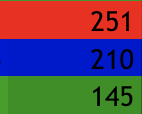
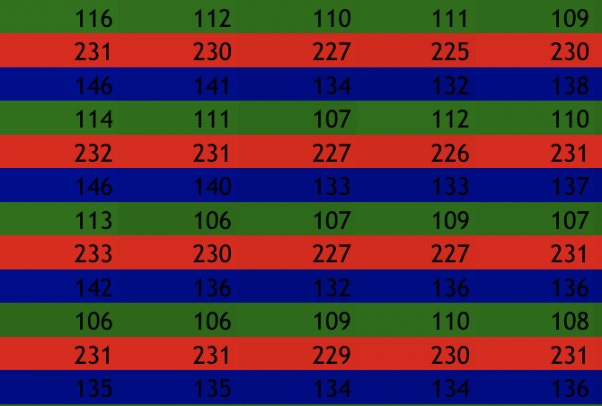

## Pixel spreadsheet

Simple script to convert an RGB image to an excel spreadsheet. Idea came from a post on [think maths](http://www.think-maths.co.uk/) website: [http://www.think-maths.co.uk/spreadsheet](http://www.think-maths.co.uk/spreadsheet)

### How does it work?

If we zoom in on an actual pixel we can see the 3 channels RGB.

This almost looks like an excel spreadsheet with alternating RGB rows doesn't it?

So we just do the same in our excel file where a single pixel looks like this:

And we just create one of these for every pixel in our image.

#### Downsampling

Images larger than 128x128 are downsampled because these excel files would be too large and would load slowly. The downsampling does keep the original width:height ratio.

### How to run

`./image2excel.py <input image>`

After running the script it will create an `output.xls` file which will contain the spreadsheet image.

### Example

**Input image**

**Output spreadsheet**

#### School project

This was an optional project for the course *Introduction to Python* at my university.

Course website: 
[https://arato.inf.unideb.hu/szathmary.laszlo/pmwiki/index.php?n=Acad.Py2019febr](https://arato.inf.unideb.hu/szathmary.laszlo/pmwiki/index.php?n=Acad.Py2019febr)

