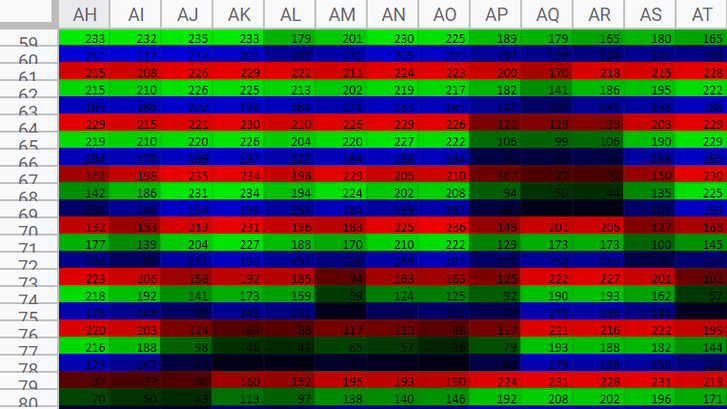

### Jegyzet

## A problema

* Az elektronikus kijelzok valojaban tablazatok, ahol a pixelek mindossza a piros, a zold es a kek szinek eltero fenyereju keppontjait jelenitik meg.


* Otlet: Excel-ben is lehetne abrazolni ezeket a keppontokat ugy, hogy az egyes cellak hatterenek a piros, a zold vagy a kek csatornak megfelelo arnyalatait rendeli.

* Az eredmeny: 



http://www.think-maths.co.uk/spreadsheet

https://index.hu/mindekozben/poszt/2019/03/26/ha_mindig_is_fotot_akart_excel-tablazatta_konvertalni_ne_keressen_tovabb

## A feladat

* Atultetni Python-ba.
* Valahogy ki kell olvasni a pixelek ertekeit, valamint valahogy irni kene egy excel tablazatba.


### Pillow konyvtar

* Kepek megnyitasara, manipulasara, kulonbozo formatumokba mentesere irt konyvtar.

#### Egy kep betoltese

```
im = Image.open(sys.argv[1])
imsize = im.size
pix = im.load()
```

### XlsxWriter konyvtar

* Excel fileok manipulalasara irt konyvtar.

```
workbook = xlsxwriter.Workbook('./output.xls')
worksheet = workbook.add_worksheet('image')
wbformat = workbook.add_format({'bg_color':colorcode})
worksheet.write(row, column, text, format)
workbook.close()
```


### Nagy kepek lassan toltenek be

* Tul nagy kepek lassan vagy egyaltalan nem toltottek be excelbe, ezert ezeknek a kepeknek a meretet kisebbre vettem.

```
im.thumbnail((128,128))
```


## Pelda

### Bemenet


### Kimenet


# TODO
* LINKEK